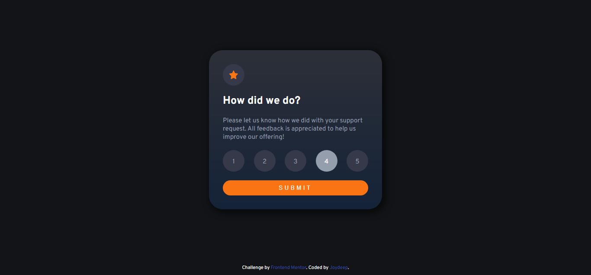
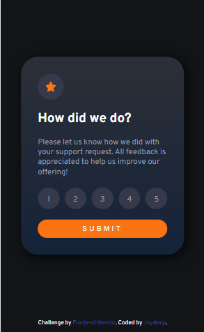

# Frontend Mentor - Interactive rating component solution

This is a solution to the [Interactive rating component challenge on Frontend Mentor](https://www.frontendmentor.io/challenges/interactive-rating-component-koxpeBUmI). Frontend Mentor challenges help you improve your coding skills by building realistic projects.

## Table of contents

- [Overview](#overview)
  - [The challenge](#the-challenge)
  - [Screenshot](#screenshot)
  - [Links](#links)
- [My process](#my-process)
  - [Built with](#built-with)
  - [What I learned](#what-i-learned)
  - [Continued development](#continued-development)
  - [Useful resources](#useful-resources)
- [Author](#author)

## Overview

### The challenge

Users should be able to:

- View the optimal layout for the app depending on their device's screen size
- See hover states for all interactive elements on the page
- Select and submit a number rating
- See the "Thank you" card state after submitting a rating

### Screenshot

Desktop Version
<br>

<br>
Desktop Version Submitted state
<br>

<br>
Mobile Version
<br>


### Links

- Solution URL: [https://github.com/halderjoydeep/FM-rating-component](https://github.com/halderjoydeep/FM-rating-component)
- Live Site URL: [https://halderjoydeep.github.io/FM-rating-component/](https://halderjoydeep.github.io/FM-rating-component/)

## My process

### Built with

- Semantic HTML5 markup
- CSS custom properties
- Flexbox
- CSS Grid
- jQuery

### What I learned

I learnt about the sessionStorage to store the data for a session to pass between different pages using javaScript.

```js
sessionStorage.setItem("rating", rating);
```

### Continued development

I'm willing to build an e-commerce website. So this rating component can be useful.

### Useful resources

- [Traversy Media](https://www.youtube.com/watch?v=0xMQfnTU6oo) - Brad Traversy's youtube videos helped me in learning Grid technique. I'm really thankful to him.
- [Angela Yu's web development course](https://www.udemy.com/course/the-complete-web-development-bootcamp/)

## Author

- Website - [Joydeep Halder](https://joydeephalder.me)
- Frontend Mentor - [@halderjoydeep](https://www.frontendmentor.io/profile/halderjoydeep)
- Github - [@halderjoydeep](https://github.com/halderjoydeep)
- LinkedIn - [Joydeep Halder](https://linkedin.com/in/joydeep-halder)
